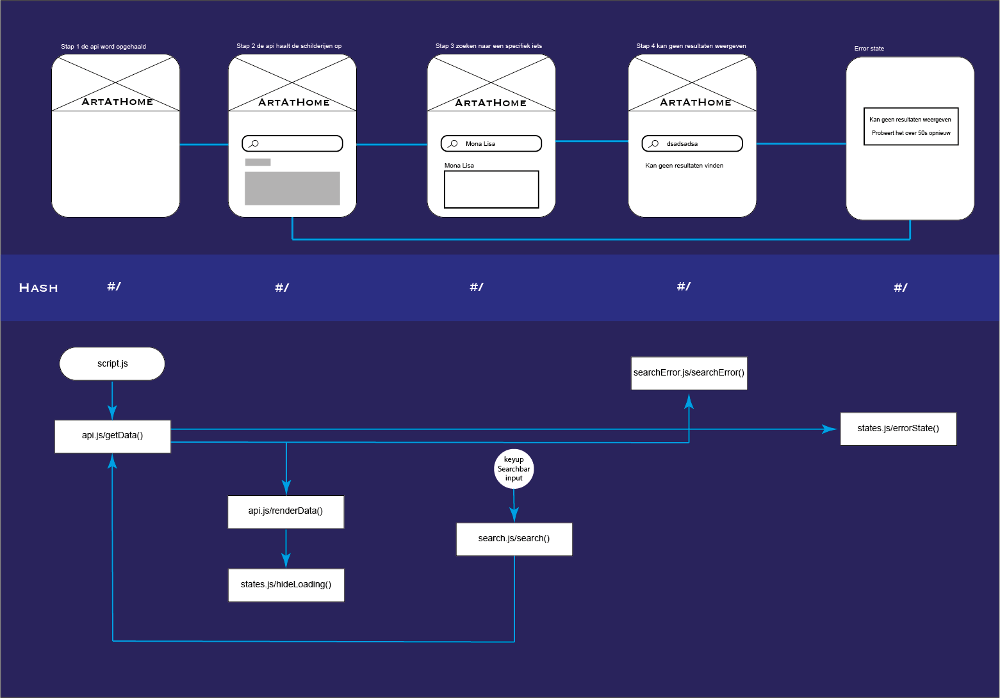
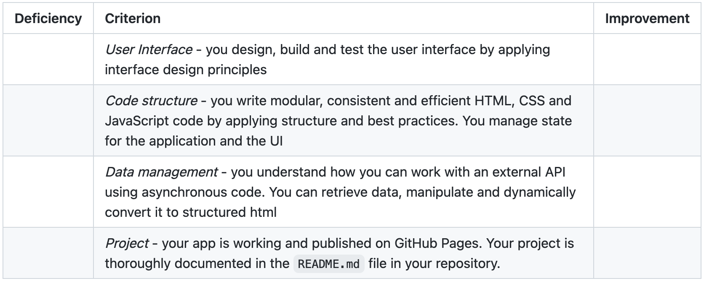

# ArtAtHome

Welkom bij mijn project van de minor Webdesign and development. Het doel van dit vak is een single page webapp maken zonder frameworks of libraries. Ik heb gekozen voor de Rijksmuseum opdracht waarbij ik een single page website moet maken waar de gebruiker schilderijen uit het rijksmuseum kan bekijken en kan zoeken naar specifieke schilderijen.

### User story

> As an art lover, I want to be able to search and view art from the Rijksmuseum at home, so that I can still enjoy art during a lockdown.

### Resultaat

Hier kan je mijn procesverslag bekijken [Procesverslag](https://github.com/fabian-vis/ArtAtHome/wiki "procesverslag")

Hier kan je de pagina bekijken [ArtAtHome](https://fabian-vis.github.io/ArtAtHome/ "ArtAtHome")

### Features

Je kan op deze single page website zoeken in de rijksmuseum API. Je kan de schilderijen bekijken, zien hoe ze heten en zien wie het schilderij gemaakt heeft. Je kan ook zoeken naar een specifiek schilderij of schilder.

### Hoe installeer je dit project op je lokale machine?

1. In je CLI plak deze code: `git clone https://github.com/fabian-vis/ArtAtHome`

2. Cd naar de juiste project folder

3. Open index.html met een liveserver extension

vergeet niet om je eigen API key aan te vragen bij de rijksmuseum API. Deze kan je dan ipv mijn key doen na `key=` bij de variable URl in het bestand var.js

### Activity diagram

### API Documentatie

Ik heb gebruik gemaakt van de Rijksmuseum API. Deze API is gratis te gebruiken en bevat alle schilderijen die zich in het rijksmuseum bevinden. Hier vind je alle informatie over de API: [Rijksmuseum - RijksData API](https://github.com/cmda-minor-web/web-app-from-scratch-2122/blob/main/course/rijksmuseum.md)

### To do

| To do                        | Done? |
| :--------------------------- | :---- |
| API connection               | ✅    |
| Empty inputfield with button | ✅    |
| Search function              | ✅    |
| Loading state                | ✅    |
| Error state                  | ✅    |
| Hash routing                 | ✅    |
| Detail Page (?)              |       |

### Rubrics

### Licence

Dit project is voorzien van een MIT licence.

### Resources

Docenten en Student-Assistenten

https://data.rijksmuseum.nl/object-metadata/api/

Medestudenten :)
